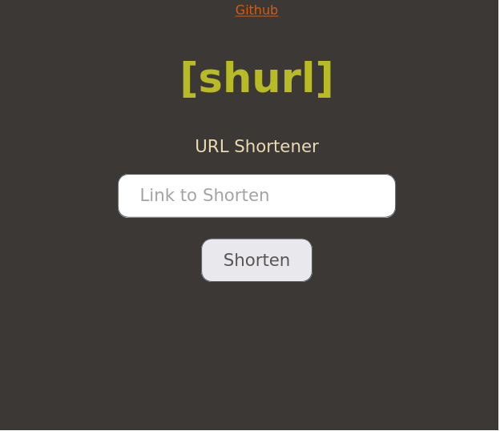

## Minimalistic gruvbox styling for webpage

## Usage
- #### From Source <br>
    Copy the `gb-light-min.css` or `gb-dark-min.css` contents from the `./css` to your local storage and use like this <br> <br>
    ``` <link rel="stylesheet" href="./gb-light.css-min" type="text/css" media="screen" title="no title" charset="utf-8">```
 <br>
 - #### Quick Use (CDN way)
    Add this line to top of your html page <br><br>
    ``` <link rel="stylesheet" href="https://arsalan.live/gb-dark-min.css" type="text/css" media="screen" title="no title" charset="utf-8" id="theme-style">```

## Toggle between Dark and Light Theme Quick Setup
- Create some button with an id of `theme-toggle`
- Put the CSS link with id of `theme-style` like this <br> <br> 
`<link rel="stylesheet" href="https://arsalan.live/gb-dark-min.css" type="text/css" media="screen" title="no title" charset="utf-8" id="theme-style">`
<br> <br>
- Add this line at the end of `body` tag in html file <br><br>
```<script src = "https://arsalan.live/toggle-theme-min.js"> </script>```

## Demo Image
